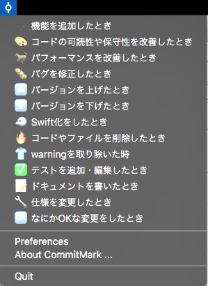
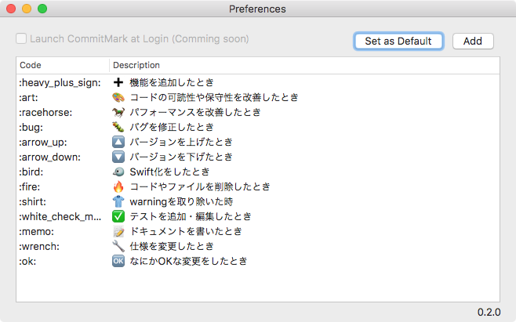

# CommitMark

**CommitMark** makes easy to input pictogram for the commitment rule with pictograms.

If you find bugs, please create a new issue.

[DOWNLOAD](https://github.com/jinSasaki/CommitMark/releases/latest)

## Features
- Run on Menu bar
- Copy to Clipboard
- Custom pictogram code and description

On Menu Bar | Preferences
--- | ---
 | 

The commitment rule with pictograms samples:

- [http://qiita.com/pocotan001/items/775cc77087be5562cc56](http://qiita.com/pocotan001/items/775cc77087be5562cc56)
- [http://mzyy94.com/blog/2015/10/14/emoji-commit-message/](http://mzyy94.com/blog/2015/10/14/emoji-commit-message/)
- [http://pronama.azurewebsites.net/2015/06/20/github-emoji-commit-message/](http://pronama.azurewebsites.net/2015/06/20/github-emoji-commit-message/)
